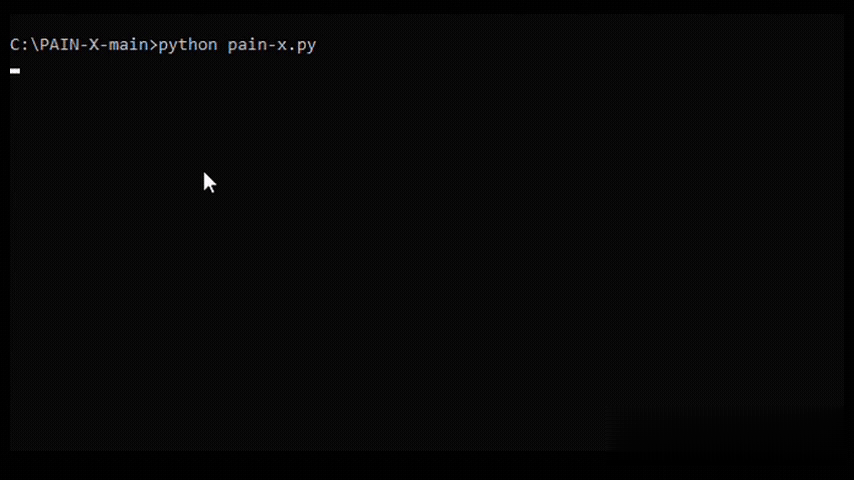
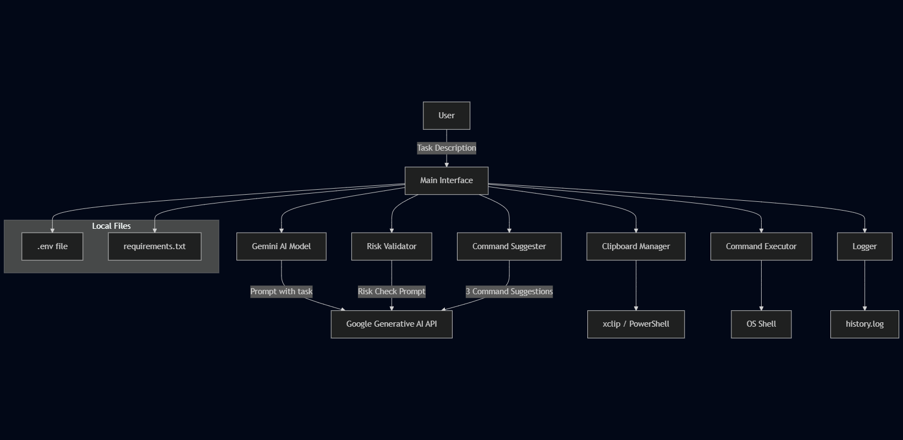

# PAIN-X (AI-Powered CLI Assistant)

PAIN-X is an AI-driven command-line tool that suggests and optionally executes safe and contextual system commands based on user input. It supports both **Linux** and **Windows** environments.



## 🧠 Powered By
- Google Gemini API (1.5 Flash)
- Python 3
- dotenv

---

## 🚀 Features

- **Quick Mode**: Instantly runs safe commands.
- **Interactive Mode**: Reviews and explains commands before execution.
- **Command Suggester**: Suggests multiple options with detailed explanation and risk analysis.
- **Clipboard Integration**: Easily copy commands for manual use.
- **AI Risk Assessment**: Warns about risky commands before execution.
- **Cross-platform Support**: Runs on Linux and Windows.
- **Logging**: Keeps command history in `history.log`.

---

## 📦 Installation

```bash
git clone https://github.com/404CISCO/PAIN-X.git
cd PAIN-X
pip install -r requirements.txt
```

**For Linux only:**
```bash
sudo apt install tmux xfce4-terminal xclip
```

---

## 🔑 Setup Gemini API Key

1. Get your Gemini API key from Google.
2. Paste the key when prompted or create a `.env` file:

```
GEMINI_API_KEY=your-api-key-here
```

---

## 📂 Run the Tool

```bash
python pain-x.py
```

You will see the terminal interface with different modes to choose from.

---

## 📘 Example Usage

- `my ip` → shows your system's IP address.
- `check disk usage` → shows disk consumption.
- `list installed software` → suggests command with explanation and risk check.


---

## 🙏 Credits

Created with ❤️ by pain.